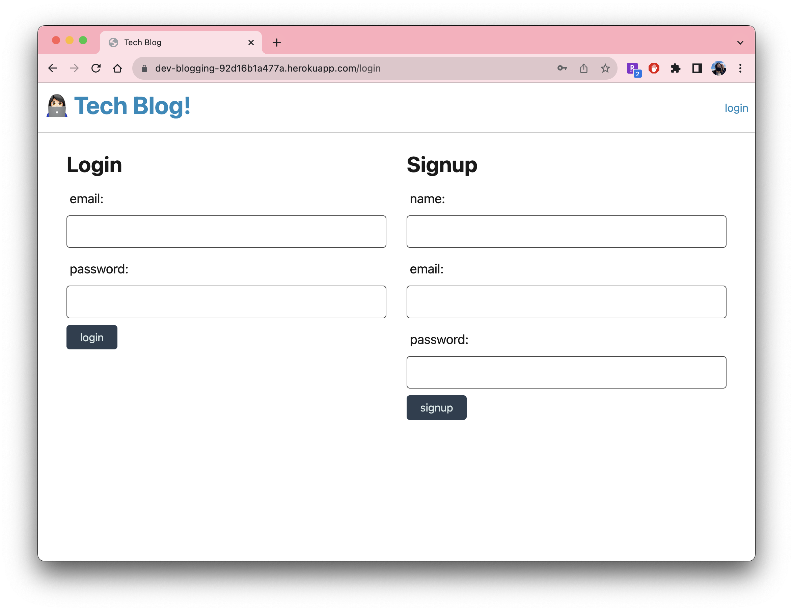
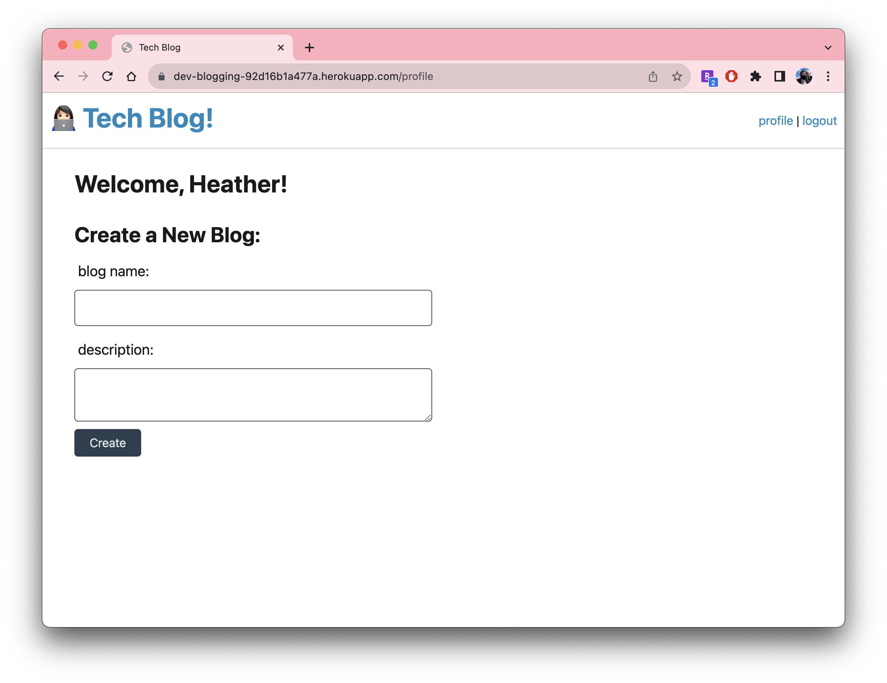

# Tech Blog

Writing about tech can be just as important as making it. Developers spend plenty of time creating new applications and debugging existing codebases, but most developers also spend at least some of their time reading and writing about technical concepts, recent advancements, and new technologies. A simple Google search for any concept covered in this course returns thousands of think pieces and tutorials from developers of all skill levels!

## Table of Contents

- [Usage](#usage)
- [Credits](#credits)
- [License](#license)
- [Features](#features)
- [Examples](#examples)

## Usage

[Login here!](https://dev-blogging-92d16b1a477a.herokuapp.com/login)

CMS-style blog site similar to a Wordpress site, where developers can publish blog posts.

```
AS A developer who writes about tech
I WANT a CMS-style blog site
SO THAT I can publish articles, blog posts, and my thoughts and opinions
```

## Credits

There are snippets of code taken from Module 14's mini project from the UofO coding bootcamp for a skeleton of the UI experience.

## License

MIT License

## Features

MVC for the code architectural structure, Node.js, npm, Handlebars.js, Sequelize, and Heroku

## Examples



